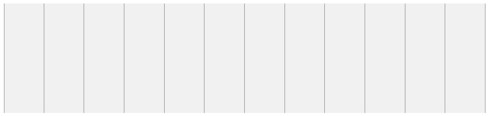
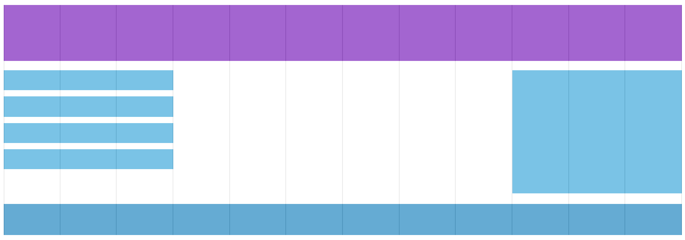
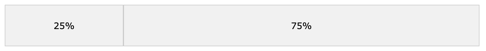

# Responsive Web Design - Grid-View

## 그리드-뷰란 무엇일까?

많은 웹페이지는 그리드-뷰에 의존합니다. 그 말은 즉 페이지가 여러개의 열로 나뉘어져 있다는 것입니다.



그리드-뷰는 웹페이지를 디자인할 때 무척 유용합니다. 이를 이용하면 웹페이지 요소들을 쉽게 배치할 수 있게 되죠.



반응형 그리드-뷰를 사용하는 웹페이지는 주로 12개의 열로 나뉘어 있고, 전체 너비가 100%이고, 브라우저 창 사이즈에 따라 줄었다 늘었다 합니다.

[w3schools 예시](https://www.w3schools.com/css/tryresponsive_grid.htm)

---

## 반응형 그리드-뷰 만들기

반응형 그리드-뷰를 만들어 봅시다.

먼저 모든 HTML 요소들의 `box-sizing` 속성이 border-box 이도록 해주어야합니다. 이는 `padding` 과 `border`이 요소의 너비와 높이에 포함되도록 설정하는 것 입니다.

```css
* {
  box-sizing: border-box;
}
```

>`box-sizing` 속성에 대해 더 알고 싶다면 [CSS Box Sizing](https://www.w3schools.com/css/css3_box-sizing.asp) 챕터에서 읽어보세요.

다음 예는 두개의 열이 있는 간단한 반응형 웹페이지를 보여줍니다.



[w3schools 예시](https://www.w3schools.com/css/tryit.asp?filename=tryresponsive_webpage)

만약 웹페이지가 두개의 열만 있다면 위의 예는 충분합니다.

하지만 저희가 지금 하고자 하는 것은 12개의 열을 가진 반응형 그리드-뷰를 사용하여 웹페이지의 디자인을 조절하는 것입니다.

먼저 한개의 열당 몇 퍼센트를 가지는 지 계산해야합니다: 100% / 12 열 = 8.33% / 열.

그리고 각각의 12개의 열마다 클래스를 만들어 줍니다. `class="col-"`와 몇개의 열을 차지할지 명시하는 것이죠.

```css
.col-1 { width: 8.33% }
.col-2 { width: 16.66% }
.col-3 { width: 25% }
.col-4 { width: 33.33% }
.col-5 { width: 41.66% }
.col-6 { width: 50% }
.col-7 { width: 58.33% }
.col-8 { width: 66.66% }
.col-9 { width: 75% }
.col-10 { width: 83.33% }
.col-11 { width: 91.66% }
.col-12 { width: 100% }
```

[w3schools 예시](https://www.w3schools.com/css/tryit.asp?filename=tryresponsive_cols)

위의 모든 열들은 왼쪽으로 `float` 되어야 하고 `15px`의 `padding`이 있어야합니다.


```css
[class*="col-"] {
  float: left;
  padding: 15px;
  border: 1px solid red;
}
```

>`[class*="col-"]` 이 부분은 **attribute contains selector** 이라는 것입니다. 자세한 내용은 shayhowe의 [complex selectors - attribute selectors](https://learn.shayhowe.com/advanced-html-css/complex-selectors/#attribute-selectors)를 참고하세요.

각각의 행은 `<div>`로 감싸져 있어야합니다. 그리고 하나의 행 안에 열의 숫자는 항상 12가 되어야 합니다.

```html
<div class="row">
  <div class="col-3">...</div> <!-- 25% -->
  <div class="col-9">...</div> <!-- 75% -->
</div>
```

행안의 열은 모두 왼쪽으로 `float` 값을 가지고 있고, 페이지의 흐름에서 벗어나게 됩니다. 다른 요소들은 마치 이 행들이 존재하지 않는 것처럼 페이지에 배치 될 것입니다. 이걸 방지하기 위해 흐름을 클리어해주는 스타일을 적용해줍니다.

```css
.row::after {
  content: "";
  clear: both;
  display: table;
}
```

> 위 선택자의 `::`는 무엇인지 아시나요? ::는 pseudo-element를 선택할 때 쓰입니다. 원래는 땡땡이가 이런식으로 `:`하나였지만 pseudo-class와 구분하기 위해 두개로 바뀌었습니다. 

약간의 스타일과 색을 넣어 더 좋게 만들어 보았습니다.

```css
html {
  font-family: "Lucida Sans", sans-serif;
}

.header {
  background-color: #9933cc;
  color: #ffffff;
  padding: 15px;
}

.menu ul {
  list-style-type: none;
  margin: 0;
  padding: 0;
}

.menu li {
  padding: 8px;
  margin-bottom: 7px;
  background-color :#33b5e5;
  color: #ffffff;
  box-shadow: 0 1px 3px rgba(0,0,0,0.12), 0 1px 2px rgba(0,0,0,0.24);
}

.menu li:hover {
  background-color: #0099cc;
}
```
[w3schools 예시](https://www.w3schools.com/css/tryit.asp?filename=tryresponsive_styles)

다음 챕터 : [Responsive Web Design - Media Query](./rwd-media-query.md)

>[w3schools.com](https://www.w3schools.com/css/css_rwd_grid.asp) 의 반응형 CSS를 토대로 한 번역입니다. 경우에 따라 추가 내용이 있을 수도 있습니다.