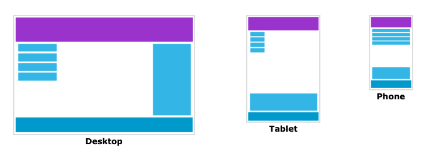

# Responsive Web Design - Introduction

## Responsive Web Design이란?

- RWD는 모든 기기에서 웹페이지를 보기 좋게 만들어준다
- RWD는 HTML과 CSS만 사용한다
- RWD는 프로그램도 아니고 자바스크립트도 아니다

## 모든 사용자에게 최상의 경험을 제공하기 위한 디자인

우리는 여러 다양한 기기에서 웹페이지들을 볼 수 있습니다. 예를 들면 컴퓨터, 타블렛, 그리고 스마트폰이죠. 웹페이지들은 기기에 관계 없이 사용하기 좋고 보기 좋아야합니다.

웹페이지들은 작은 기기들에게 맞도록 비어있지 않고 어떤 기기에서든 내용을 그에 맞게 변화해야합니다.

CSS와 HTML을 사용하여 내용을 숨기거나, 줄이거나, 늘리거나, 움직이거나, 혹은 사이즈를 바꾸는 것이 바로 Responsive Web Design 입니다.

아래의 예시를 완전히 이해하지 않아도 괜찮습니다. 이어지는 챕터들에서 코드를 하나하나 나누어 차근히 살펴볼 것 입니다.

다음 챕터 : [Responsive Web Design - The Viewport](./rwd-the-viewport.md)

>[w3schools.com](https://www.w3schools.com/css/css_rwd_intro.asp) 의 반응형 CSS를 토대로 한 번역입니다. 경우에 따라 추가 내용이 있을 수도 있습니다.