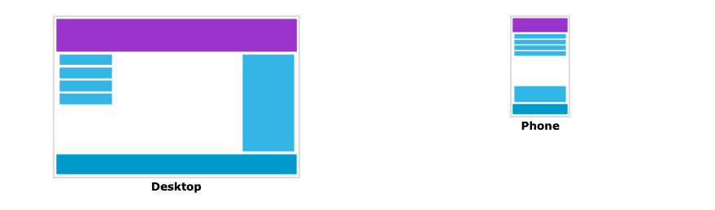
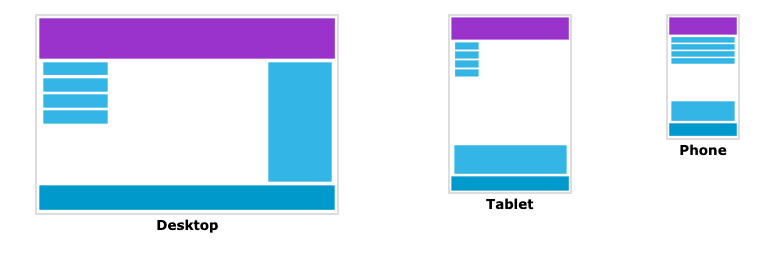

# Responsive Web Design - Media Query

## Media Query란?

Media query는 CSS3에서 소개된 CSS 테크닉 입니다.

`@media` 룰을 사용하여 어떤 특정 조건에서만 CSS 블록 안의 내용을 유효하게 하는 것 입니다.

예시를 한번 봅시다.

### Example

만약 브라우저 윈도우가 600 px 보다 작거나 같을 경우, background-color는 lightblue 여야한다면 아래와 같이 media query를 사용할 수 있습니다.

```css
body {
  background-color: lightgreen;
}
@media only screen and (max-width: 600px) {
  body {
    background-color: lightblue;
  }
}
```
<button>[w3schools 예시](https://www.w3schools.com/css/tryit.asp?filename=tryresponsive_mediaquery)</button>

## Breakpoint를 추가하자

이 튜토리얼의 이전 부분에서 행과 열로 구성된 웹페이지를 만들었습니다. 반응형 웹페이지였지만 작은 스크린에선 보기 좋지 않았습니다.

media query를 사용하면 breakpoint를 추가하여 특정 부분의 디자인이 각각의 breakpoint마다 다르게 보여지도록 할 수 있습니다.



media query를 사용하여 breakpoint를 768px에 추가해봅시다.

```css
/* 데스크탑 */
.col-1 {width: 8.33%}
.col-2 {width: 16.66%}
.col-3 {width: 25%}
.col-4 {width: 33.33%}
.col-5 {width: 41.66%}
.col-6 {width: 50%}
.col-7 {width: 58.33%}
.col-8 {width: 66.66%}
.col-9 {width: 75%}
.col-10 {width: 83.33%}
.col-11 {width: 91.66%}
.col-12 {width: 100%}

@media only screen and (max-width: 768px) {
  /* 스마트폰 */
  [class*="col-"] {
    width: 100%;
  }
}
```
<button>[w3schools 예시](https://www.w3schools.com/css/tryit.asp?filename=tryresponsive_breakpoints)</button>
---

## 항상 Mobile First 디자인을 하자

Mobile First는 항상 모바일 기기에 맞도록 우선 디자인을 한 뒤에 데스크탑이나 다른 기기에 맞추어 디자인하는 것을 말합니다. (이는 작은 기기에 페이지가 빠르게 디스플레이되도록 도와줍니다)

이 말은 즉 현재 CSS에서 바꿔야할 점이 있다는 것입니다.

너비가 `768px` 보다 작을 때 스타일이 바뀌도록 하는 것보다는, 너비가 `768px` 보다 클 때 스타일이 바뀌도록 하는 것입니다. 이렇게 하면 현재 디자인을 Mobile First로 바꾸어 줍니다.

```css
/* 스마트폰 */
[class*="col-"] {
  width: 100%;
}

@media only screen and (min-width: 768px) {
  /* 데스크탑 */
  .col-1 {width: 8.33%}
  .col-2 {width: 16.66%}
  .col-3 {width: 25%}
  .col-4 {width: 33.33%}
  .col-5 {width: 41.66%}
  .col-6 {width: 50%}
  .col-7 {width: 58.33%}
  .col-8 {width: 66.66%}
  .col-9 {width: 75%}
  .col-10 {width: 83.33%}
  .col-11 {width: 91.66%}
  .col-12 {width: 100%}
}
```

<button>[w3schools 예시](https://www.w3schools.com/css/tryit.asp?filename=tryresponsive_mobilefirst)</button>
---

## 추가적인 Breakpoint

Breakpoint는 원하는 만큼 추가해도 상관 없습니다.

이번에는 태블릿과 스마트폰 사이에 breakpoint를 추가해봅시다.



media query와 위와 동일한 클래스 묶음을 너비가 `600px` 보다 크지만 `768px` 보다 작은 기기에서 보이도록 추가합니다.

```css
/* 스마트폰: */
[class*="col-"] {
  width: 100%;
}

@media only screen and (min-width: 600px) {
  /* 태블릿: */
  .col-s-1 {width: 8.33%;}
  .col-s-2 {width: 16.66%;}
  .col-s-3 {width: 25%;}
  .col-s-4 {width: 33.33%;}
  .col-s-5 {width: 41.66%;}
  .col-s-6 {width: 50%;}
  .col-s-7 {width: 58.33%;}
  .col-s-8 {width: 66.66%;}
  .col-s-9 {width: 75%;}
  .col-s-10 {width: 83.33%;}
  .col-s-11 {width: 91.66%;}
  .col-s-12 {width: 100%;}
}

@media only screen and (min-width: 768px) {
  /* 데스크탑: */
  .col-1 {width: 8.33%;}
  .col-2 {width: 16.66%;}
  .col-3 {width: 25%;}
  .col-4 {width: 33.33%;}
  .col-5 {width: 41.66%;}
  .col-6 {width: 50%;}
  .col-7 {width: 58.33%;}
  .col-8 {width: 66.66%;}
  .col-9 {width: 75%;}
  .col-10 {width: 83.33%;}
  .col-11 {width: 91.66%;}
  .col-12 {width: 100%;}
}
```

두개의 동일한 클래스 묶음이 있는 것이 이상하게 보일 수도 있지만, HTML에서 각각의 breakpoint에 어떻게 동작할지 조작할 수 있습니다.

데스크탑: 첫번째와 세번째 섹션은 3개의 열을 차지하도록 하고, 가운데 섹션은 6개의 열을 차지하도록 설정합니다.

태블릿: 첫번째 섹션은 3개의 열, 두번째 섹션은 9개의 열, 그리고 세번째 섹션은 다음 행에 12개의 열을 차지하도록 합니다.

```html
<div class="row">
  <div class="col-3 col-s-3">...</div>
  <div class="col-6 col-s-9">...</div>
  <div class="col-3 col-s-12">...</div>
</div>
```
<button>[w3schools 예시](https://www.w3schools.com/css/tryit.asp?filename=tryresponsive_col-s)</button>

---

## 주로 사용되는 breakpoints

스크린의 너비와 높이는 기기의 종류에 따라 엄청나게 다양합니다. 그렇기 때문에 각각의 기기에 맞도록 정확한 breakpoint를 만드는 것은 어렵습니다. 하지만 간단하게 5개의 그룹으로 나눌수 있습니다.

```css
/* 엄청 작은 사이즈의 기기들 (스마트폰, 600px 이하) */
@media only screen and (max-width: 600px) {...}

/* 작은 사이즈의 기기들 (태블릿, 큰 스마트폰, 600px 이상) */
@media only screen and (min-width: 600px) {...}

/* 중간 사이즈의 기기들 (스마트폰, 768px 이상) */
@media only screen and (min-width: 768px) {...}

/* 큰 사이즈의 기기들 (스마트폰, 992px 이상) */
@media only screen and (min-width: 992px) {...}

/* 엄청 큰 사이즈의 기기들 (스마트폰, 1200px 이상) */
@media only screen and (min-width: 1200px) {...}
```
<button>[w3schools 예시](https://www.w3schools.com/css/tryit.asp?filename=tryresponsive_mediaquery_breakpoints)</button>

---

## 화면 방향: portrait / landscape

미디어 쿼리는 뷰포트에 너비에 따라 웹페이지가 다르게 스타일되도록 할 수 있지만 브라우저의 방향에 따라 다르게 보여지게 할 수도 있습니다.

브라우저 창의 너비가 높이보다 클 때, 즉 landscape 방향일 때만 특정 스타일을 적용할 수 있습니다.

```css
@media only screen and (orientation: landscape) {
  body {
    background-color: lightblue;
  }
}
```

<button>[w3schools 예시](https://www.w3schools.com/css/tryit.asp?filename=tryresponsive_mediaquery_orientation)</button>

---

## Media query를 이용하여 요소 숨기기

media query의 또 다른 흔한 사용 용도는 스크린의 사이즈에 따라 숨기는 것 입니다.
```css
@media only scree and (max-width 600px) {
  div.example {
    display: none;
  }
}
```
<button>[w3school 예시](https://www.w3schools.com/css/tryit.asp?filename=trycss_mediaqueries_hide)</button>

---

## Media query를 이용하여 폰트 사이즈 바꾸기

media query를 이용하여 스크린 사이즈에 따라 폰트 사이즈를 변경할 수도 있습니다.

```css
@media only screen and (min-width 601px) {
  div.example {
    font-size: 80px;
  }
}

@media only scree and (max-width: 600px) {
  div.example {
    font-size: 30px;
  }
}
```
<button>[w3school 예시](https://www.w3schools.com/css/tryit.asp?filename=trycss_mediaqueries_fontsize)</button>

>[w3schools.com](https://www.w3schools.com/css/css_rwd_mediaqueries.asp) 의 반응형 CSS를 토대로 한 번역입니다. 경우에 따라 추가 내용이 있을 수도 있습니다.